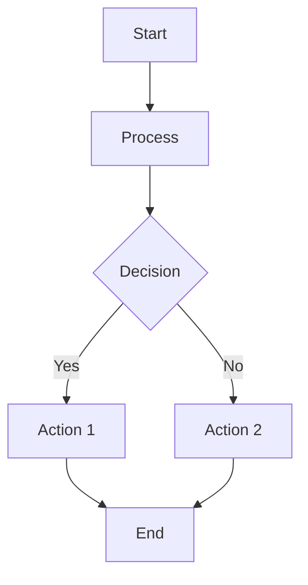

This theme supports generating various diagrams from a text description using [jekyll-diagrams](https://github.com/zhustec/jekyll-diagrams){:target="\_blank"} plugin.
Below, we generate a few examples of such diagrams using languages such as [mermaid](https://mermaid-js.github.io/mermaid/){:target="\_blank"}, [plantuml](https://plantuml.com/){:target="\_blank"}, [vega-lite](https://vega.github.io/vega-lite/){:target="\_blank"}, etc.

**Note:** different diagram-generation packages require external dependencies to be installed on your machine.
Also, be mindful that because of diagram generation, the first time you build your Jekyll website after adding new diagrams will be SLOW.
For any other details, please refer to [jekyll-diagrams](https://github.com/zhustec/jekyll-diagrams){:target="\_blank"} README.


## Mermaid

If you cannot use the `` tag directly, you can generate diagrams using tools like the [Mermaid Live Editor](https://mermaid-js.github.io/mermaid-live-editor/) and include them as images. Alternatively, follow the steps below to generate static diagrams.

### Install Mermaid CLI
Install Mermaid using `node.js` package manager `npm` by running the following command:
```bash
npm install -g mermaid.cli
```

### Replace with Static Diagram
Generate the Mermaid diagram as an image and include it in your post. For example:

```markdown

```

### Example Diagram Code
If you use the Mermaid syntax, you can create diagrams like the following:



### Static Example
If the generated image is saved locally:


For more dynamic use cases, ensure your environment supports the `jekyll-diagrams` plugin. Let me know if you encounter further issues!
